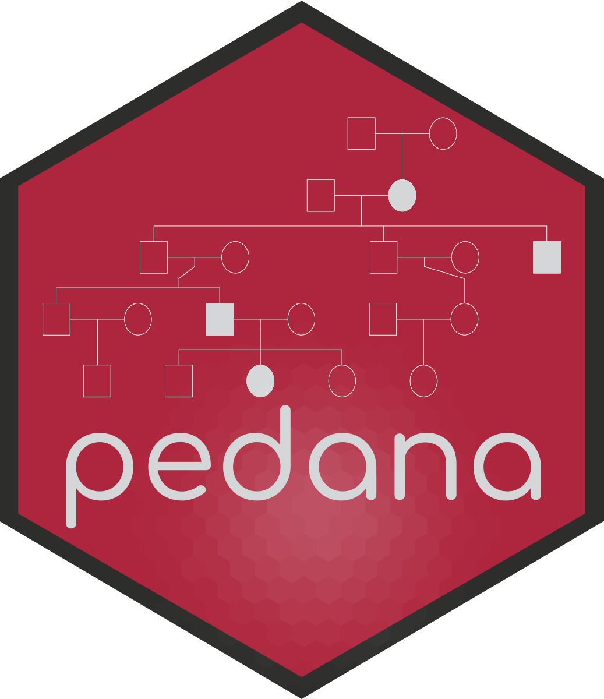

```{r setup, include = FALSE}
knitr::opts_chunk$set(fig.path = "man/figures/")
```

# pedana 

`pedana` is an R package providing functions to generate pedigrees 
and to simulate the transmission of traits of various modes of inheritance. 
With this `Shiny` app, the package offers students from secondary school 
throughout university the possibility to exercise pedigree analysis. In 
addition, it offers teachers and lecturers the opportunity to generate 
pedigree problems.

### Installation guide

The package is currently available via 
[GitHub](https://github.com/justintimm/pedana) and can be downloaded from there 
using the `devtools` package. 

```{r install, eval = FALSE}
install.packages("devtools")
devtools::install_github("justintimm/pedana")
```

### Getting started

After installing the package from GitHub, you can start practicing pedigree 
analysis by running the Shiny app via `run_pedigree_analysis()`.

```{r start, eval = FALSE}
library(pedana)
run_pedigree_analysis()
```

If you are interested in simulating pedigree problems outside the Shiny 
environment, use `sim_pedigree_problem()` in combination with `plot()`, 
which, in turn, is a wrapper to the excellent plot method from the R package 
`kinship2` (for detail, see `plot.ped()` and `kinship2::plot.pedigree()`).

```{r store-figure, eval = TRUE, fig.align = "center"}
library(pedana)
plot(sim_pedigree_problem(inheritance = "AD", generations = 4, seed = 5))
```

### Contribute 

If you have any questions or suggestions for improvement, 
you are cordially invited to contribute directly via 
[GitHub](https://github.com/justintimm/pedana) 
or to [contact me](mailto:justin.timm@uni-due.de).

# Acknowledgements

The idea for this package and some of the preliminary work was done during 
my work for the project "Bildungsgerechtigkeit im Fokus" (Educational 
Equity in Focus) at the [University of Duisburg-Essen](https://www.uni-due.de). 
In addition, several people have supported me in various ways in the 
development of this app. First of all, I would like to thank Julia Surmann, who 
did a preliminary work on the development of the pedigree simulation function 
as part of her master's thesis. I would also like to thank René Doernemann, 
who did preliminary work on entering arguments and providing individual 
feedback as part of a Bachelor's thesis. Finally, I would like to thank 
Prof. Philipp Schmiemannn, Prof. Christian Johannes, Dr. Yvonne Lettmann, 
Dr. Markus Bergmann, Julia Franken, and Annika Brechmann for great hints 
and ideas from both, genetic and educational perspectives. 

The project "Bildungsgerechtigkeit im Fokus" was financially supported by 
the German Federal Ministry of Education and Research as part of the 
Qualitätspakt Lehre (Quality Pact Teaching) under grant number 01PL16075. 
The responsibility for the content of this publication is held by the author.
