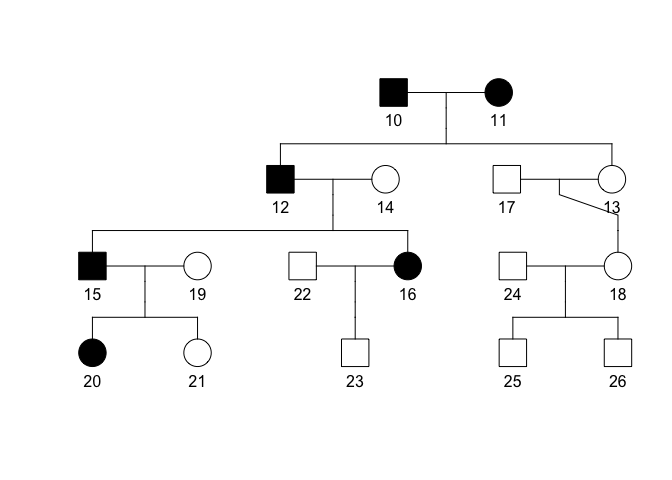

# pedana 

`pedana` is an R package providing functions to generate pedigrees and
to simulate the transmission of traits of various modes of inheritance.
With this `Shiny` app, the package offers students from secondary school
throughout university the possibility to exercise pedigree analysis. In
addition, it offers teachers and lecturers the opportunity to generate
pedigree problems.

### Installation guide

The package is currently available via
[GitHub](https://github.com/justintimm/pedana) and can be downloaded
from there using the `devtools` package.

``` r
install.packages("devtools")
devtools::install_github("justintimm/pedana")
```

### Getting started

After installing the package from GitHub, you can start practicing
pedigree analysis by running the Shiny app via
`run_pedigree_analysis()`.

``` r
library(pedana)
run_pedigree_analysis()
```

If you are interested in simulating pedigree problems outside the Shiny
environment, use `sim_pedigree_problem()` in combination with `plot()`,
which, in turn, is a wrapper to the excellent plot method from the R
package `kinship2` (for detail, see `plot.ped()` and
`kinship2::plot.pedigree()`).

``` r
library(pedana)
plot(sim_pedigree_problem(inheritance = "AD", generations = 4, seed = 5))
```



### Contribute

If you have any questions or suggestions for improvement, you are
cordially invited to contribute directly via
[GitHub](https://github.com/justintimm/pedana) or to [contact
me](mailto:justin.timm@uni-due.de).

# Acknowledgements

The idea for this package and some of the preliminary work was done
during my work for the project “Bildungsgerechtigkeit im Fokus”
(Educational Equity in Focus) at the [University of
Duisburg-Essen](https://www.uni-due.de). In addition, several people
have supported me in various ways in the development of this app. First
of all, I would like to thank Julia Surmann, who did a preliminary work
on the development of the pedigree simulation function as part of her
master’s thesis. I would also like to thank René Doernemann, who did
preliminary work on entering arguments and providing individual feedback
as part of a Bachelor’s thesis. Sina Zupanc and Sabine Prüfert also
contributed great ideas as part of their master’s theses. Thank you very
much. Finally, I would like to thank Prof. Philipp Schmiemannn,
Prof. Christian Johannes, Dr. Yvonne Lettmann, Dr. Markus Bergmann,
Julia Tocco, and Annika Brechmann for great hints and ideas from both,
genetic and educational perspectives.

The project “Bildungsgerechtigkeit im Fokus” was financially supported
by the German Federal Ministry of Education and Research as part of the
Qualitätspakt Lehre (Quality Pact Teaching) under grant number
01PL16075. The responsibility for the content of this publication is
held by the author.

*pedana* includes multiple ideas to increase the learning efficiency,
such as working examples (Sweller 2006), self-explanation prompts
(Mackensen-Friedrichs 2009; Renkl 1997, 2014), fading (Renkl and
Atkinson 2003), and elaborated feedback in combination with try again
feedback (Narciss and Huth 2004; Narciss and Huth 2006).

# References

<p>
Mackensen-Friedrichs I (2009). “Die Rolle von Selbsterklärungen aufgrund
vorwissensangepasster, domänenspezifischer Lernimpulse beim Lernen mit
biologischen Beispielaufgaben.” <em>Zeitschrift für Didaktik der
Naturwissenschaften</em>, <b>15</b>, 155–172.
</p>
<p>
Narciss S, Huth K (2004). “How to design informative tutoring feedback
for multimedia learning.” In Niegemann H, Brünken R, Leutner D (eds.),
<em>Instructional design for multimedia learning: Proceedings of the 5th
International Workshop of SIG 6 Instructional Design of the European
Association for Research on Learning and Instruction (EARLI), June 27 -
29, 2002 in Erfurt</em>, chapter 13, 181–195. Waxmann.
</p>
<p>
Narciss S, Huth K (2006). “ostering achievement and motivation with
bug-related tutoring feedback in a computer-based training for written
subtraction.” <em>Learning and Instruction</em>, <b>16</b>, 310–322.
<a href="https://doi.org/10.1016/j.learninstruc.2006.07.003">doi:10.1016/j.learninstruc.2006.07.003</a>.
</p>
<p>
Renkl A (1997). “Learning from Worked-Out Examples: A Study on
Individual Differences.” <em>Cognitive Science</em>, <b>21</b>, 1–29.
<a href="https://doi.org/10.1207/s15516709cog2101_1">doi:10.1207/s15516709cog2101_1</a>.
</p>
<p>
Renkl A (2014). “Toward an instructionally oriented theory of
example-based learning.” <em>Cognitive Science</em>, <b>38</b>, 1–37.
<a href="https://doi.org/10.1111/cogs.12086">doi:10.1111/cogs.12086</a>.
</p>
<p>
Renkl A, Atkinson R (2003). “Structuring the Transition From Example
Study to Problem Solving in Cognitive Skill Acquisition: A Cognitive
Load Perspective.” <em>Educational Psychologist</em>, <b>38</b>, 15–22.
<a href="https://doi.org/10.1207/S15326985EP3801_3">doi:10.1207/S15326985EP3801_3</a>.
</p>
<p>
Sweller J (2006). “The worked example effect and human cognition.”
<em>Learning and Instruction</em>, <b>16</b>, 165–169.
<a href="https://doi.org/10.1016/j.learninstruc.2006.02.005">doi:10.1016/j.learninstruc.2006.02.005</a>.
</p>
